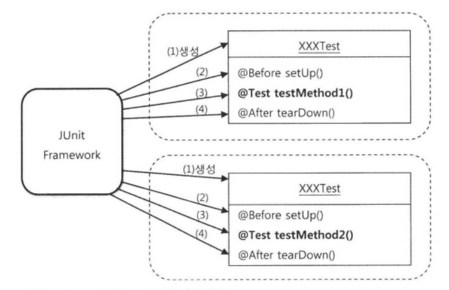

# 2장 - 테스트

## Intro

### 두 번째 중요한 전략

* 에플리케이션은 계속 변하고 복잡해져 감. 그 변화에 대응하기 위한 전략이 2가지가 있음
  * 첫번째 전략, 객체지향적 설계와 그것을 효과적으로 담을 **IoC/DI 기술**
  * 두번째 전략, 만들어진 코드를 확신할 수 있게 해주고, 변화에 유연하게 대처할 수 있게 해주는 자신감을 주는 **테스트 기술**

## 2.1. UserDaoTest 다시보기

### 2.1.1 테스트의 유용성

* 테스트란 내가 예상하고 의도했던 대로 코드가 정확히 동작하는지를 확인해서, 만든 코드를 확신할 수 있게 해주는 작업

### 2.1.2 UserDaoTest의 특징

* 웹을 통한 DAO 테스트 방법의 문제점
  * 보통 웹 에플리케이션 테스트 방식
    * DAO, 서비스 클래스, 컨트롤러, JSP 뷰 등 모든 계층의 기능을 다 만들고 나서야 테스트가 가능
  * 어디에서 문제가 발생했는지 찾기 힘듦. 테스트에 모든 계층이 참여하고 있기 때문
  * 그렇다면?

* 작은 단위의 테스트
  * 테스트는 가능하면 작은 단위로 쪼개서 할 수 있어야 함 -> (unit test)단위 테스트
  * 물론 전 과정이 하나로 묶인 통합 테스트도 필요
    * 그렇지만 단위 테스트가 없이 통합 테스트에서 오류가 난다면 문제의 원인을 찾기 매우 힘듦
    * 이미 각 단위별로 충분한 검증을 하고 있다면 오류를 찾는 범위가 훨씬 줄어듬

### 2.1.3 UserDaoTest의 문제점

* 수동 확인 작업의 번거로움
  * 테스트 수행은 코드에 의해 자동으로 진행
  * 하지만, 테스트의 결과를 확인하는 일은 사람의 책임
  
* 실행 작업의 번거로움
  * 실행 가능한 main() 메소드라고 하더라도 Test용 클래스가 한 애플리케이션에 수백 개라면?
  * 수백 번 실행해야하는 수고가 필요
  * 좀 더 편리하고 체계적으로 테스트를 실행하고 확인하는 방법이 필요

## 2.2. UserDaoTest 의 개선

### 2.2.1. 테스트 검증의 자동화

* 모든 테스트는 성공과 실패의 두 가지 결과를 가짐
  * 성공
  * 실패
    * 테스트가 진행되는 동안에 에러가 발생해서 실패하는 경우 (테스트 에러)
    * 테스트 작업 중에 그 결과가 기대한 것과 다르게 나오는 경우 (테스트 실패)

* 테스트 에러는 쉽게 확인이 가능
  * 콘솔에 에러 메시지와 호출 스택 정보가 출력됨
* 테스트 실패는 별도의 확인 작업이 필요

### 2.2.2. 테스트의 효율적인 수행과 결과 관리

* 자바로 단위 테스트를 할때 사용할 수 있는 테스트 프레임워크 -> JUnit
* JUnit 프레임워크가 요구하는 조건
  * 메소드가 public으로 선언되어야 함
  * 메소드에 @Test 애노테이션을 붙여주는 것

## 2.3. 개발자를 위한 테스팅 프레임워크 JUnit

* 스프링 프레임워크 자체도 JUnit 프레임워크로 테스트하면서 만들어짐
* 별도의 **스프링 테스트 모듈** 이 있으며 기반은 JUnit이다.

### 2.3.1. 테스트 실행 방법

TOOL 에 관한 설명으로 생략

### 2.3.2. 테스트 결과의 일관성

* 단위 테스트는 항상 **일관성 있는 결과가 보장**되어야 함
  * 외부 환경에 영향을 받지 말아야 함
  * 테스트를 실행하는 순서를 바꿔도 동일한 결과가 보장되도록 만들어야 함

### 2.3.3. 포괄적인 테스트

* JUnit은 하나의 클래스 안에 여러 개의 테스트 메소드가 들어가는 것을 허용
  * @Test 애노테이션이 있고
  * public 접근자가 있으며
  * 리턴 값이 void 형이고
  * 파라미터가 없어야 함
* JUnit은 특정한 테스트 메소드의 실행 순서를 보장해주지 않음

* get() 예외 조건에 대한 테스트
 * 예외 조건이 발생하는 경우 2가지 방법으로 대처
   * null과 같은 특별한 값을 리턴
   * 예외를 던지는 것 (예시로는 이 방법을 사용)
 * 예외를 던져 예외 발생 여부를 확인하는 것은 @Test 애노테이션의 expected 엘리먼트를 사용
   * expected는 테스트 메소드 실행 중에 발생하리라 기대하는 예외 클래스를 넣어주면 됨
   * 예시에서는 EmptyResultDataAccessExcepption 클래스를 넣어줌
   ```java
     @Test(expected = EmptyResultDataAccessException.class)
   ```

### 2.3.4. 테스트가 이끄는 개발

* 기능설계를 위한 테스트
  * 테스트 할 코드가 없지만, 추가하고 싶은 기능을 코드로 표현하려고 했기 때문에 getUserFailure() 테스트를 작성할수 있었음

|     | 단계         | 내용                       | 코드  |
| --- | ---------- | ------------------------ |---|
| 조건  | 어떤 조건을 가지고 | 가져오는 사용자 정보가 존재하지 않는 경우에 | dao.deleteAll(); assertThat(dao.getCount(),is(0)); |
| 행위  | 무엇을 할때     | 존재하지 않는 id로 get() 을 실행하면 |  get("unknown_id")   |
| 결과  | 어떤 결과가 나온다 | 특별한 예외가 던져진다.            |  @Test(expected = EmptyResultDataAccessException.class)   |

* Test Driven Development(TDD) 테스트 주도 개발
  * 테스트 코드를 먼저 만들고, 테스트를 성공하게 해주는 코드를 작성하는 방식의 개발 방법
  * 기본 원칙 - 실패한 테스트를 성공시키기 위한 목적이 아닌 코드는 만들지 않음

### 2.3.5. 테스트 코드 개선

* 테스트 코드도 리펙토링의 대상이 됨
* UserDaoTest에서 반복되는 부분이 있음
```java
  ApplicationContext ac = new GenericXmlApplicationContext("applicationContext.xml");
  UserDao dao = ac.getBean("userDao", UserDao.class);
```
* JUnit 프레임워크는 매번 테스트 메소드를 실행하기 전에 먼저 실행시켜주는 기능이 있음 -> @Before 애노테이션
* **@Before**
  * 모든 @Test가 붙은 메소드 실행 전에 자동으로 실행
  * 주고받을 정보나 오브젝트가 있다면 인스턴스 변수를 이용
    * JUnit은 테스트 메소드를 실행할 때마다 새로운 오브젝트를 만들기 때문
    * 그래서 각 테스트가 독립적으로 실행됨을 보장해줌
    
  

* Fixture(픽스쳐)
  * 테스트를 수행하는데 필요한 정보나 오브젝트
  * 일반적으로 반복적으로 사용하기 때문에 @Before에 생성해 두면 편리함

## 2.4. 스프링 테스트 적용

* 애플리케이션 컨텍스트는 만들어질 때 모든 싱글톤 빈 오브젝트를 초기화함
  * 문제! 빈이 많아지고 복잡해지면 애플리케이션 컨텍스트 생성에 적지 않은 시간이 걸림
  * 해결! 
    * 테스트 전체가 공유하는 오브젝트를 만듦
    * 빈은 싱글톤으로 만들었기 때문에 상태를 갖지 않음 즉, 문제 없음
  * 어떻게? 
    * JUnit은 테스트 클래스 전체에 걸쳐 딱 한 번만 실행되는 @BeforeClass 스태틱 메소드를 지원
    * 스프링은 JUnit을 이용하는 테스트 컨텍스트 프레임워크를 제공

### 2.4.1. 테스트를 위한 어플리케이션 컨텍스트 관리

* 스프링 테스트 컨텍스트 프레임워크 적용

```java
  @RunWith(SpringJUnit4ClassRunner.class)
  @ContextConfiguration(locations = "/applicationContext.xml")
  public class UserDaoTest {
      @Autowired
      private ApplicationContext context;
  ...
```

  * @RunWith 는 JUnit 프레임워크의 테스트 실행 방법을 확장할 때 사용하는 애노테이션
  * SpringJUnit4ClassRunner.class는 JUnit이 테스트를 진행하는 중에 테스트가 사용할 에플리케이션 컨텍스트를 만들고 관리하는 작업을 진행함
  * @ContextConfiguration 자동으로 만들어줄 애플리케이션 컨텍스트의 설정파일 위치를 지정

* 테스트 클래스의 컨텍스트 공유
  * 테스트 클래스 사이에서 같은 설정파일을 가진 애플리케이션 컨텍스트를 사용한다면, 애플리케이션 컨텍스트를 공유하게 해줌
  * @Autowired 는 변수 타입과 일치하는 컨텍스트 내의 빈을 찾아서 DI 해줌 (타입에 의한 자동 와이어링)
    * 변수 타입이 일치하는 빈이 2개 이상인 경우 이름을 확인하고 그래도 찾을 수 없는 경우 예외를 발생시킴
  * 스프링 애플리케이션 컨텍스트는 초기화시 자기 자신도 빈으로 등록
    * 애플리케이션 컨텍스트에는 ApplicationContext 타입의 빈이 존재하는 셈이고 DI도 가능

### 2.4.2. DI 와 테스트

* 만약 절대로 DataSource의 구현 클래스를 바꾸지 않는다면 굳이 Datasource 인터페이스를 사용하고 DI를 통해 주입받는 방식을 쓸 필요 있나?
* 그래도 써야하는 이유 3가지
  * 첫째, 소프트웨어 개발에서 절대로 바뀌지 않는 것은 없기 때문
  * 둘째, 다른 차원의 서비스 기능을 도입할 수 있기 때문
    * 예시로는 DB 커넥션의 개수를 카운팅하는 기능
  * 셋째, 테스트 때문

* 테스트 코드에 의한 DI
  * DI의 장점을 살려 테스트에서만 다른 DataSource를 사용하게 할 수 있는 방법은? (우선순위 높은 순)
    * 컨테이너 없는 DI 테스트
      * 테스트 수행 속도가 빠르며 테스트 자체가 간결함
      * 오브젝트 생성과 초기화가 단순하면 사용
    * 스프링의 설정을 이용한 DI 방식의 테스트
      * 여러 오브젝트와 복잡한 의존관계를 갖고 있는 오브젝트를 테스트해야 하는 경우
      * 환경에 따라 각기 다른 설정파일을 구성 (개발, 테스트, 운영)
    * 컨텍스트에서 DI 받은 오브젝트에 다시 테스트 코드로 수동 DI 해서 테스트
      * @DirtiesContext 애노테이션 사용
        * 스프링의 테스트 컨텍스트 프레임워크에게 해당 클래스의 테스트에서 애플리케이션 컨텍스트의 상태를 변경한다는 것을 알려줌
      * 애플리케이션 컨텍스트 공유를 허용하지 않음

## 2.5. 학습 테스트로 배우는 스프링

* learning test(학습 테스트) - 자신이 만들지 않은 프레임워크나 다른 개발팀에서 만들어서 제공한 라이브러리 등에 대한 테스트
  * 목적
    * 자신이 사용할 API나 프레임워크의 기능을 테스트로 보면서 사용 방법을 익히려는 것
  * 장점
    * 다양한 조건에 따른 기능을 손쉽게 확인해볼 수 있다
    * 학습 테스트 코드를 개발 중에 참고할 수 있다
    * 프레임워크나 제품을 업그레이드할 때 호환성 검증을 도와준다
    * 테스트 작성에 좋은 훈련이 된다
    * 새로운 기술을 공부하는 과정이 즐거워진다
* bug test(버그 테스트) - 코드에 오류가 있을 때 그 오류를 가장 잘 드러내줄 수 있는 테스트
  * 버그가 원인이 되서 테스트가 실패하는 코드를 만듬 그러고 나서 버그 테스트가 성공할 수 있도록 코드를 만듬
  * 필요성 및 장점
    * 테스트의 완성도를 높여준다
    * 버그의 내용을 명확하게 분석하게 해준다
    * 기술적인 문제를 해결하는 데 도움이 된다

> 동등분할(equivalence partitioning)
>
> * 같은 결과를 내는 값의 범위를 구분해서 각 대표 값으로 테스트하는 방법    
>
> * 어떤 작업의 결과의 종류가 true, false 또는 예외발생 세 가지라면 각 결과를 내는 입력 값이나 상황의 조합을 만들어 모든 경우에 대한 테스트를 해보는 것이 좋음

> 경계값 분석(boundary value analysis)
>
> * 에러는 동등분할 범위의 경계에서 주로 많이 발생한다는 특징을 이용해서 경계의 근처에 있는 값을 이용해 테스트하는 방법    
> 
> * 보통 숫자의 입력 값인 경우 0 이나 그 주변 값 또는 정수의 최대값, 최소값 등으로 테스트해보면 도움이 될 때가 많음

## 2.6. 정리

* 테스트는 자동화되어야 하고, 빠르게 실행가능해야 함
* main() 테스트 대신 **JUnit 프레임워크**를 이용한 테스트 작성이 편리
* 테스트 결과는 일관성이 있어야 함. 코드의 변경 없이 환경이나 테스트 실행 순서에 따라서 결과가 달라지면 안 됨
* 테스트는 포괄적으로 작성해야 함. 충분한 검증을 하지 않는 테스트는 없는 것보다 나쁠 수 있음
* 코드 작성과 테스트 수행의 간격이 짧을수록 효과적
* 테스트하기 쉬운 코드가 좋은 코드
* 테스트를 먼저 만들고 테스트를 성공시키는 코드를 만들어가는 **테스트 주도 개발 방법**도 유용
* 테스트 코드도 애플리케이션 코드와 마찬가지로 적절한 리팩토링이 필요
* **@Before, @After**를 사용해서 테스트 메소드들의 공통 준비 작업과 정리 작업을 처리할 수 있음
* **스프링 테스트 컨텍스트 프레임워크**를 이용하면 테스트 성능을 향상시킬수 있음
* 동일한 설정파일을 사용하는 테스트는 하나의 애플리케이션 컨텍스트를 공유
* **@Autowired**를 사용하면 컨텍스트의 빈을 테스트 오브젝트에 DI 할 수 있음
* 기술의 사용 방법을 익히고 이해를 돕기 위해 학습 테스트를 작성
* 오류가 발견될 경우 그에 대한 버그 테스트를 만륻어두면 유용
